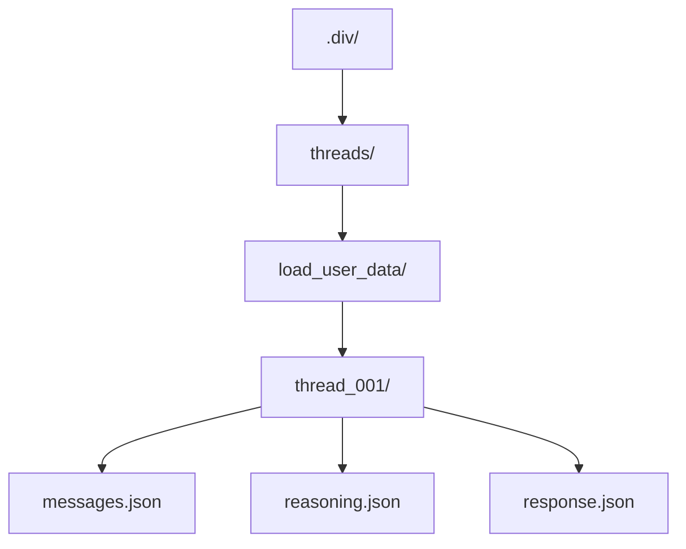

`Threads` are like children nodes of the div-tree, representing the evolution of a prompt or contract. They are organized in a way that allows for easy navigation and understanding of the design process.

A good way to understand what threads are is to think of them as a series of conversations or iterations that lead to the final implementation. Each thread captures a specific aspect of the design process, allowing for easy review and critique.

## 🧵 threads/ (Derived Prompt Iterations)

Each thread_xxx/ folder contains a linear chain of messages, reflecting an LLM session or refinement cycle tied to a contract + prompt pair.

Use threads/ to:

    Review how generations evolved

    Support critique loops

    Maintain reproducibility

